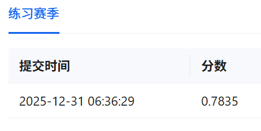
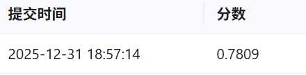

# DL-Final
The Task of DL-Final
## Progress

- [x] Baseline-1
- [x] Baseline-2
- [ ] Model-Change
- [ ] New-Model
- [ ] Report

## Log

### @TimeAgent

- 修复 TypeError `task4\DNN-DAC\preprocess.py` make_data，以适应现使用数据集格式
- 修复 AssertionError `task4\DNN-DAC\preprocess.py` make_data，处理数据集脏数据，未知标签及空字符串""归类为'Other'
- 新增 save_test函数 `task4\DNN-DAC\train_eval.py` & `task4\DNN-DAC\run.py`，用于保存测试集结果,生成.json文件，用于提交评测
- 因无test数据集标签，原test函数无效，仅需使用save_test函数生成.json文件
- 运行`task4\DNN-DAC\run.py`后，自动train-eval-test，生成.json文件
#### Run Preprocess
进入DL-Final文件夹，所有命令基于此目录。
使用下面命令预处理数据集
```shell
python task4\DNN-DAC\preprocess.py
```
#### Run Baseline-1 TextCNN
```shell
python task4\DNN-DAC\run.py --model TextCNN
```
复现TextCNN测评结果



#### Run Baseline-2 TextRCNN
```shell
python task4\DNN-DAC\run.py --model TextRCNN 
```
复现TextRCNN测评结果

