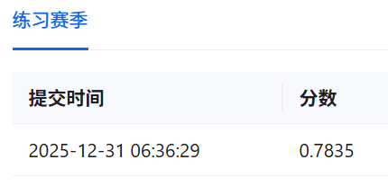
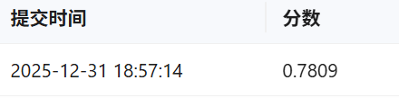
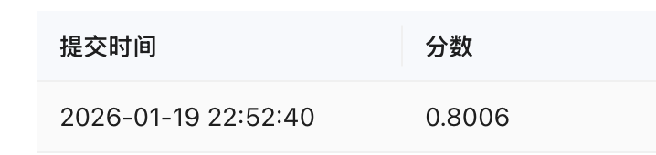
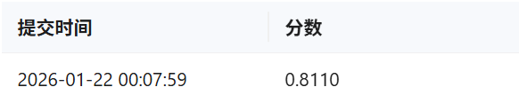

# DL-Final

The Task of DL-Final.

> **总体要求：**
>
> 1）请各位同学组成1-4人的小组在以下赛题中**任选其一**，每个小组只需提交一份实验报告。组内所有成员的得分相同。
>
> 2）每个小组将实验代码、输出文件和实验报告打包为小组编号-大作业-深度学习.rar（或.zip），提交到链接https://yunbiz.wps.cn/c/collect/cELerW72kpT中。报告提交的截止日期为**2026年1月23日23:59:59**。
>
> 3）实验评分标准为比赛得分情况和报告撰写质量。报告中需要包含所有模型在比赛平台上的测评结果截图。
>
> **赛题三：医疗诊疗对话意图识别挑战赛**
>
> 比赛链接：https://tianchi.aliyun.com/competition/entrance/532044/information
>
> 比赛梗概：识别医患对话的意图
>
> 实验要求：
>
> 1）阅读并运行比赛页面赛题与数据章节给出的至少两个baseline代码，并在实验报告中说明所使用baseline的原理。
>
> 2）将baseline中的模型简单改为其他的任意一个语言模型（例如RoBERTa、ALBERT、GPT2等），比较其性能。
>
> 3）根据深度学习课程所学，基于深度学习自行设计一个模型并计算结果。请在实验报告中说明设计思路。

## 1 Progress

- [x] Baseline-1 TextCNN
- [x] Baseline-2 TextRCNN
- [x] Model-Change
- [x] New-Model
- [x] Report

## 2 Log

### 2.1 @Yan（@TimeAgent-X）

- 修复 TypeError `task4\DNN-DAC\preprocess.py` make_data，以适应现使用数据集格式
- 修复 AssertionError `task4\DNN-DAC\preprocess.py` make_data，处理数据集脏数据，未知标签及空字符串""归类为'Other'
- 新增 save_test函数 `task4\DNN-DAC\train_eval.py` & `task4\DNN-DAC\run.py`，用于保存测试集结果,生成.json文件，用于提交评测
- 因无test数据集标签，原test函数无效，仅需使用save_test函数生成.json文件
- 运行`task4\DNN-DAC\run.py`后，自动train-eval-test，生成.json文件

>[!Tip]
>test输出`.json`文件位于`task4\DNN-DAC\THUCNews\log\<MODEL_NAME>\<TIME>\IMCS-DAC_test.json`。后续提交`IMCS-DAC_test.json`文件至https://tianchi.aliyun.com/competition/entrance/532044/information 进行测评。

#### Run Preprocess

进入`DL-Final`文件夹，所有命令基于此目录。
使用下面命令预处理数据集

```shell
python task4\DNN-DAC\preprocess.py
```
#### Run Baseline-1 TextCNN

```shell
python task4\DNN-DAC\run.py --model TextCNN
```
复现 TextCNN 测评结果 **@Acc 0.7835** 



#### Run Baseline-2 TextRCNN

```shell
python task4\DNN-DAC\run.py --model TextRCNN 
```
复现 TextRCNN 测评结果 **@Acc 0.7809**



### 2.2 @Zhou

#### BERT (Model_Change) - **New Best Model**

> 引入了基于 BERT 的预训练模型，并针对显存限制（2.7GB）进行了深度优化。

- **模型架构**: `bert-base-chinese`
- **优化技术**: 开启梯度检查点 (Gradient Checkpointing)、使用 SGD 优化器以减少显存占用。
- **性能**: **验证集**准确率达到 **80.64%**，F1 分数 **0.7346**。

**运行命令**:

```shell
python task4\DNN-DAC\run.py --model Model_Change
```

**Test结果**:
最终生成的结果文件为 `task4/IMCS-DAC_test_predictions.json`。

`Model_Change`测评结果 **@Acc 0.8006**

> [!Tip] 
> 测评截图存储路径：`temp/image_Model_Change.png`



### 2.3 @Wang （@Yan @TimeAgent-X）

#### Run New_Model

```shell
python task4\DNN-DAC\run.py --model New_Model
```

`New_Model`**最新**测评结果 **@Acc 0.8110**

> [!Tip] 
> 测评截图存储路径：`temp/image_New_Model.png`



### 2.4 @Chen（@TimeAgent-X）

- 已完成报告撰写。


## 3 注意

> [!Important]
>
> 1. 复现模型 [ TextCNN、TextRCNN（要求1）]、替换模型 [ Model_Change （要求2）] 及新模型 [ New_Model （要求3）] 文件位于`task4\DNN-DAC\models`文件夹中。
> 2. 数据集文件夹为`task4\IMCS-DAC。
> 3. 预处理数据位于`task4\DNN-DAC\THUCNews\data`文件夹中。
> 4. 输出用于测评的json文件位于`task4\DNN-DAC\THUCNews\log`中。
> 5. 由于模型权重文件较大，暂未上传。
> 6. `run.py`为入口文件，命令等详见上方Log。
> 7. 确保相关环境配置等无误代码可正确执行。